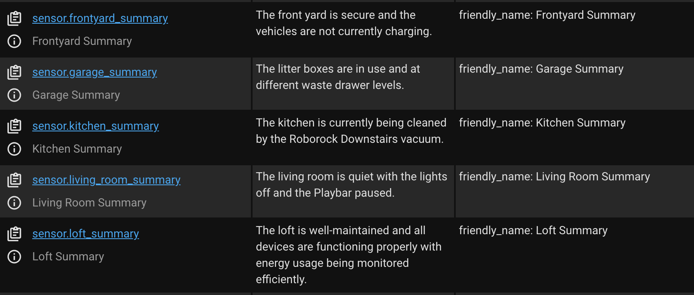

# home-assistant-summary-agent

A Home Assistant Conversation Agent that summarizes the state of the Home.

This repository is no longer needed since we have developed [AI Task](https://www.home-assistant.io/integrations/ai_task/).

### Area Summary

The Area Summary agent provides a [Conversation Agent](https://www.home-assistant.io/integrations/conversation/) that can summarize an [Area](https://www.home-assistant.io/docs/organizing/areas/)
succinctly.

### Area Summary Sensors

A sensor is created for every area that is a succinct summary of what is happening in the area.

For example, for an area named `Kitchen` a diagnostic sensor is created called `sensor.kitchen_summary`
that describes everything happening in the area e.g. `The kitchen is dark`.



### Template Examples

You can see the `config/` subdirectory for other example summary agent recipes.

### Development

See https://github.com/allenporter/home-assistant-datasets for additional detail about
how to evaluate an LLM in Home Assistant.

```bash
$ export PYTHONPATH="${PYTHONPATH}:${PWD}"
$ pip install uv
$ uv venv --python=3.13
$ source .venv/bin/activate
$ uv pip install -r requirements_dev.txt --prerelease=allow
$ py.test
```
